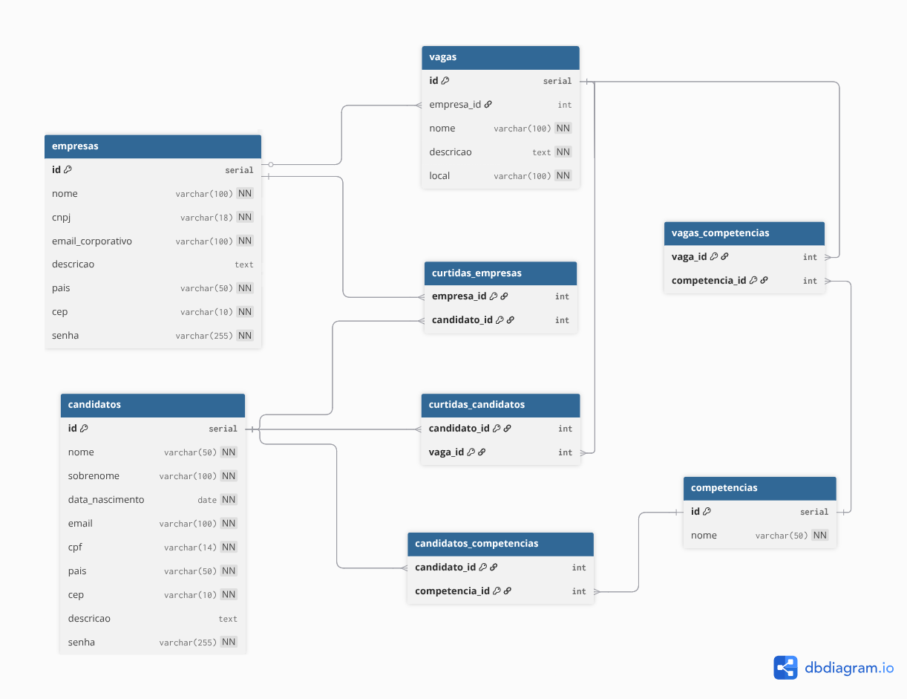

# Linketinder 

## Sobre o Projeto
O Linketinder é um Produto Mínimo Viável (MVP) de um sistema de recrutamento estratégico. Inspirado na dinâmica de conexões de aplicações de relacionamento e no detalhamento de perfil de redes profissionais, o sistema tem como objetivo principal facilitar o encontro entre empresas e candidatos com base no alinhamento de competências.

O projeto está estruturado em múltiplas camadas (Backend, Frontend e Banco de Dados), que operam para validar as regras de negócio, a estrutura de dados e a interface do utilizador.

## Arquitetura e Tecnologias

### 1. Banco de Dados (PostgreSQL)
A persistência de dados foi modelada utilizando um Banco de Dados Relacional para garantir a integridade das informações e dos relacionamentos complexos (Match).
- **PostgreSQL**: Sistema Gerenciador de Banco de Dados.
- **dbdiagram.io**: Ferramenta utilizada para a criação do Diagrama Entidade-Relacionamento (DER/MER).
- **Estrutura**: Composta por 8 tabelas, incluindo entidades principais (`candidatos`, `empresas`, `vagas`, `competencias`) e tabelas associativas para gerir relacionamentos N:N e o sistema de "Curtidas/Match".

### 2. Backend (Groovy)
Desenvolvido aplicando conceitos sólidos de Programação Orientada a Objetos (POO), TDD (Test-Driven Development) e inspirado no padrão MVC.
- **Groovy**: Linguagem principal.
- **Gradle**: Ferramenta de automação de builds e gestão de dependências.
- **Spock Framework**: Utilizado para testes unitários e validação de regras de negócio.

### 3. Frontend (TypeScript)
Desenvolvido como uma Single Page Application (SPA) estruturada para garantir tipagem forte e validação rigorosa no lado do cliente.
- **TypeScript**: Superset de JavaScript para garantir tipagem estática e interfaces rigorosas.
- **Expressões Regulares (Regex)**: Utilizadas para validação assíncrona e em tempo real dos dados inseridos.
- **HTML5 & CSS3 / Chart.js**: Estruturação visual e renderização de gráficos de dados.

## Modelagem de Dados (MER/DER)
Abaixo está a representação visual da modelagem do banco de dados desenvolvida para o projeto:

## Funcionalidades
- **Gestão de Perfis e Vagas**: Registo de novos candidatos, empresas e vagas através de formulários interativos.
- **Validação de Dados Avançada (Regex)**: O sistema impede o registo de dados inválidos (E-mails, formatação de CPF/CNPJ/CEP, telefones, links e padronização de competências).
- **Listagens Dinâmicas e Anonimato**: Na visão da empresa, os nomes dos candidatos são ocultados (ex: "Candidato Anónimo 1"), focando no recrutamento às cegas. O mesmo se aplica às vagas.
- **Sistema de Match Lógico**: Cruzamento de dados relacionais (SQL) onde um "Match" apenas ocorre quando uma Empresa e um Candidato demonstram interesse mútuo.
- **Análise de Dados**: Geração de um gráfico de barras dinâmico na visão da empresa.

## Como Executar o Projeto

### Configuração do Banco de Dados
1. Certifique-se de ter o PostgreSQL instalado e a rodar no seu ambiente.
2. Crie um banco de dados em branco.
3. Navegue até à pasta `database/` do projeto e execute o script `linketinder.sql` na sua ferramenta de preferência (pgAdmin, DBeaver, etc.) para criar as tabelas e popular os dados iniciais.

### Execução do Backend
1. Abra o diretório raiz do projeto na sua IDE e aguarde a sincronização do Gradle.
2. Navegue até `src/main/groovy/Main.groovy` e execute a aplicação.

### Execução do Frontend
1. Abra um terminal e navegue para dentro da pasta `frontend`.
2. Execute `npm install` seguido de `npm run dev`.
3. O navegador abrirá automaticamente a interface do sistema.

## Desenvolvido por

Henrique Oliveira dos Santos  
[LinkedIn](https://www.linkedin.com/in/dev-henriqueo-santos/)